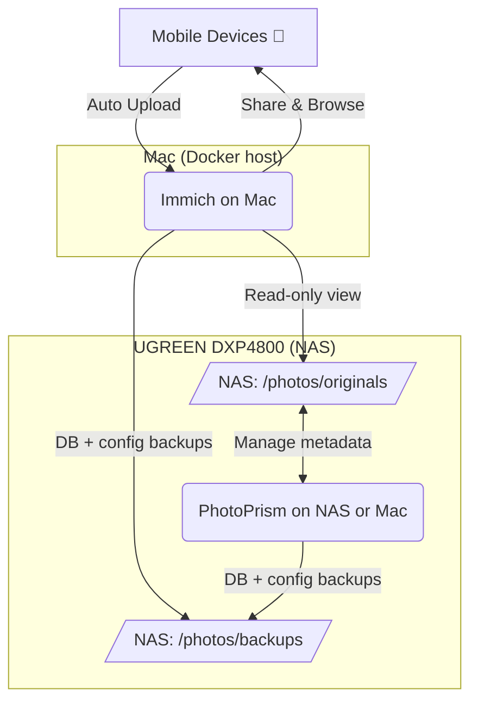

# 📸 Immich + PhotoPrism Hybrid Photo-Stack Setup Playbook

A guide to deploying a self-hosted photo management stack.

## Goal
Run [Immich](https://immich.app) (a Google Photos analog for mobile photo uploads and viewing) and [PhotoPrism](https://photoprism.app) (a Adobe Lightroom analog for metadata management and archival) on a **Mac** with a **Docker-capable NAS**, using:

* Shared NAS storage
* Tailscale for secure remote access
* Weekly automated backups via `launchd`
* Version-controlled configuration

Should work about the same on Linux but hasn't been tested

### 🔄 Daily Usage / Workflow

1. **Auto uploads from phones** → Immich uploads → `/photos/uploads/from-immich/`
2. **Browse & share** → Immich reads `/photos/originals` (read-only)
3. **Curation** → in PhotoPrism, import new uploads into `/photos/originals/YYYY/...`
4. **Archiving** → PhotoPrism updates metadata
   1. Tag, rate, add keywords; PP writes XMP/sidecars.
   2. Work with RAW files
5. Run weekly DB backups → NAS `/photos/backups/`
6. Remote access via Tailscale (private) or Caddy (public)

## 🧬 Architecture Overview



### 🧩 Summary Table

| Task                | Tool       | Host | Notes                    |
| ------------------- | ---------- | ---- | ------------------------ |
| Auto uploads        | Immich     | Mac  | Mobile → NAS             |
| Metadata management | PhotoPrism | NAS  | XMP + tagging            |
| Private access      | Tailscale  | All  | Encrypted mesh VPN       |
| Public sharing      | Caddy      | Mac  | HTTPS + domain           |
| Weekly backup       | launchd    | Mac  | To NAS `/photos/backups` |

## 📂 Repository Structure

```
photo-stack/
├── compose/
│   ├── immich.yml
│   └── photoprism.yml
│   └── caddy.yml
├── scripts/
│   └── setup_nas_mount.sh
│   └── setup_backup_launch_agent.sh
│   └── backup_photo_dbs.sh
│   └── ...
├── Caddyfile.example
├── .env.example
├── .gitignore
└── README.md
```

## 📂 NAS Directory Structure

Subject to change but hopefully helpful overview

```
/photos/
├── originals/                 # Main library (RAW/JPG/Video)
├── uploads/
│   ├── from-immich/           # Mobile auto-upload inbox
└── backups/                   # DB and config backups
    ├── immich/
    └── photoprism/
```

On the host machine
```
~/
├── photoprism/                # PP DB + sidecars
│   ├── storage/
├── immich/                    # Immich DB
│   └── postgres/
```

## 🧮 Setup Instructions

### Clone Repo

```sh
git clone git@github.com:kareemf/photo-stack-playbook.git
cd photo-stack-playbook
```

### Create .env File

```sh
cp .env.example .env
ln -s .env compose/.env
```

### Create Local Database Directories

On the host machine storage device

```sh
mkdir -p ~/photoprism/{storage}
mkdir -p ~/immich/{postgres}
```

### Setup NAS Directories 

On your storage device

```sh
mkdir -p ~/photos/{originals,uploads/from-immich,photoprism/{storage},immich,backups}
```

...or do it manually

!!! Note
  Potential Gotcha: Keep Immich read-only on /photos/originals to avoid metadata clashes

### Persistent Mount of NAS on Mac

Use the helper script to mount your NAS share with the credentials in `.env` (`NAS_USER`, `NAS_USERPASS`, `NAS_HOST`; optional `NAS_SHARE` defaults to `photos`; `NAS_MOUNT_POINT` defaults to `/Volumes/Photos`):

```bash
chmod +x scripts/setup_nas_mount.sh
./scripts/setup_nas_mount.sh          # add --dry-run to preview without changes
```

The script runs entirely without `sudo`. Make sure `NAS_MOUNT_POINT` already exists and is writable by your macOS user (create it manually if you stick with `/Volumes/Photos`, or set `NAS_MOUNT_POINT` to a directory under your home folder). To prepare the default path once:

```bash
sudo mkdir -p /Volumes/Photos
sudo chown "$USER":staff /Volumes/Photos
```

Re-run the script after reboots to reconnect, or add it to your login items if you want it mounted automatically. Unmount manually with `umount "$NAS_MOUNT_POINT"`.

If you change `NAS_MOUNT_POINT`, remember to update any Docker bind mounts (see the files in `compose/`) so they point to the same path.

Optional: create a user LaunchAgent so the mount script runs at login (and optionally retries):

```bash
chmod +x scripts/setup_mount_launch_agent.sh
./scripts/setup_mount_launch_agent.sh          # add --interval 900 to retry every 15 minutes
launchctl load ~/Library/LaunchAgents/com.user.photo-mount.plist
```

Disable with `launchctl unload ~/Library/LaunchAgents/com.user.photo-mount.plist`. Delete the plist if you no longer need the auto-mount.

### 🐳 Docker Compose
 
*(See the `compose/` directory for full definitions.)*

#### FYI: Makefile Helpers
Keeps the `.env` file wired in and lets you control Immich, PhotoPrism, or Caddy:

```bash
make up # Start both stacks
make immich up
make photoprism up

make pull # Refresh images for both stacks
make immich pull
make photoprism pull

make down # Stop both stacks
make immich down
make photoprism down

make logs follow
make immich logs
make photoprism logs
make logs # Aggregated tail logs for both stacks (tail=100, follow)
```

Internally the Makefile shells out to `docker compose --env-file .env -f compose/<stack>.yml …`. 
Override `ENV_FILE`, `STACK`, or `TAIL` on the command line if needed (e.g. `make STACK=immich TAIL=200 logs`).


💡 Handy commands once everything is up and running
```sh
make immich down && make immich up && make immich logs follow
```

```sh
make photoprism down && make photoprism up && make photoprism logs follow
```

```sh
make photoprism index          # runs photoprism index --cleanup
make photoprism index force    # includes --force for a full reindex
```

#### Manual Commands
```bash
# Start Immich (Mac mini)
make immich pull
make immich up

# Start PhotoPrism (NAS or Mac)
make photoprism pull
make photoprism up
```

#### Check Container Logs and Health

```sh
docker ps
```

```sh
make logs
```

OR

```sh
docker compose --env-file .env -f compose/immich.yml logs -f --tail=100 immich-server
docker compose --env-file .env -f compose/photoprism.yml logs -f --tail=100 photoprism
```

!!! Note
  You might see `Error: connect ECONNREFUSED 172.18.0.4:5432` from `immich_server` in the logs initally. This is normal while containers are still starting up
 
#### Addresses

PhotoPrism should be available at http://127.0.0.1:2342/
Immich should be available at http://127.0.0.1:2283/

### Immich: Import Read-Only Library
Official docs: https://docs.immich.app/features/libraries/

#### Add library
* Login. 
* Go to http://localhost:2283/admin/library-management
* Add `/originals` when asked for the path, which should line up with the volume mounted in immich.yml (`${NAS_MOUNT_POINT}/originals:/originals:ro`)
* Hit Validate
* Hit Save

#### Exclude RAWs

> We don't want to import the raw files to Immich
 Official docs: https://docs.immich.app/features/libraries/
  
* Menu -> Scan Settings -> Add exlusion pattern
* Add: `**/*.{arw,cr2,cr3,dng,nef,orf,pef,raf,rw2,srw}`
* Hit Save

!!! Note
  If you add additional volumes, expose them to both `immich-server` and `database`


### Photoprism: Performance Considerations & Troubleshooting
#### Empty index after restart
- Keep `/photoprism/storage` (which holds the DB, thumbsnails, sidecars, etc.) on local disk (ideally SSD) instead of NAS
  - Impact: If storage isn’t mounted to a persistent volume, PhotoPrism may come up with a fresh, empty index after a container update or restart. Docs [discourage NAS storage](https://docs.photoprism.app/getting-started/troubleshooting/performance/?utm_source=chatgpt.com#storage)

#### Only partially indexing (sometimes not indexing subfolders)
- Increase Docker resources available to docker (Cores, RAM, and Swap)
- Mount NAS drives via NFS instead of SMB
  - More stable and performant during indexation
- Possible red herring: Use the “Library → Index” view as source of truth.


### Staggered First-Run Indexing

Run PhotoPrism indexing first
```sh
make photoprism index
```
or
```sh
docker compose --env-file .env -f compose/photoprism.yml exec photoprism photoprism index --cleanup
```

Then let Immich scan (it auto-indexes on start; if needed, restart after PP completes)
```sh
docker compose --env-file .env -f compose/immich.yml restart immich-server
```


## 💾 Backup DB + Configs to NAS

All DB/config backups are stored under `/photos/backups/`.

Script: `scripts/backup_photo_dbs.sh`

Make it executable:

```bash
chmod +x scripts/backup_photo_dbs.sh
```

### ⚙️ Automating Backups (macOS `launchd`)

`launchd` is preferred over `cron` for macOS because it:

* Handles sleep/wake cycles gracefully
* Uses native logging under `~/Library/Logs`
* Can be managed with `launchctl` or `brew services`

#### Dependencies

```bash
brew install watch plistwatch
```

#### Launch Agent: `~/Library/LaunchAgents/com.user.photo-backup-dbs.plist`

Write the Launch Agent plist with the helper script (defaults: Sunday 3 AM; adjust with `--weekday`/`--hour`):

```bash
chmod +x scripts/setup_backup_launch_agent.sh
./scripts/setup_backup_launch_agent.sh
```

Load and verify:

```bash
launchctl load ~/Library/LaunchAgents/com.user.photo-backup-dbs.plist
launchctl start com.user.photo-backup-dbs
launchctl list | grep photo-backup-dbs
tail -f ~/Library/Logs/photo-backup-dbs.log
```

✅ Backups run weekly (Sunday 3 AM). Adjust `Weekday`/`Hour` as needed.

Use `./scripts/setup_backup_launch_agent.sh --help` to see override options.

---

## 🔐 Secure Remote Access + Pretty Names

### Private Remote Access With Tailscale

Use **Tailscale** for private, end-to-end encrypted access to your stack without touching router port-forwarding.

📘 **Documentation:**

* [Getting Started with Tailscale](https://tailscale.com/kb/1032/install)
* [MagicDNS](https://tailscale.com/kb/1081/magicdns)

Typical access pattern:

* Immich → `https://mac.tailnet.ts.net:2283`
* PhotoPrism → `https://mac.tailnet.ts.net:2342`

Use [Access Control Lists (ACLs)](https://tailscale.com/kb/1018/acls)[ss Control Lists (ACLs)](https://tailscale.com/kb/1018/acls) to restrict access by user or device.
For secure collaboration, grant Tailnet access to trusted family devices only.

Note that you do not need to run the Caddy container if this is where you plan to stop.

### Public Remote Access (Sharing with Non-Tailnet Users) + Custom Domains

#### Choose your exposure model
- **Cloudflare Tunnel** (no port-forwarding, works with custom domains `immich.example.com` / `prism.example.com`)
  - No additional costs beyond domain registration
- **Public DNS + Caddy (Let’s Encrypt)**: requires DNS control over `example.com` *and* ports 80/443 reachable from the internet.
    - Additional cost of ~$5+ per month for a VPS 
    - Additional security considerations if port-forwarding on home router

In either case, the end state should be 
- `immich.example.come` and `prism.example.come` are globally accessible
- Your home stack stays private behind Tailscale and/or Cloudflare
- End‑to‑end encryption with TLS certificates

#### Cloudflare Tunnel

Like Tailscale Funnel, [Cloudflare Tunnel](https://developers.cloudflare.com/cloudflare-one/networks/connectors/cloudflare-tunnel/) keeps services private but reachable without port-forwarding or setting up a VPS. Unlike Funnel, it supports custom domains 

**Benefits:**
- No router port-forwarding required
- No VPS costs (~$5/month savings vs DigitalOcean)
- Cloudflare handles DDoS protection and TLS termination
- Works on free tier

**Requirements:**
- Domain registered with Cloudflare. Partial CNAME setup [not supported on free tier](https://developers.cloudflare.com/dns/zone-setups/partial-setup/))
- `cloudflared` daemon running on a machine (same host as Docker or separate)

##### Configuration Options

The setup varies based on two key decisions:

| Decision            | Option A (Recommended) | Option B                    | Notes                       |
| ------------------- | ---------------------- | --------------------------- | --------------------------- |
| **TLS Termination** | Cloudflare handles TLS | Caddy handles TLS           | Option A is simpler         |
| **Tunnel Location** | Same machine as Docker | Different machine (VPS/NAS) | Same machine = less latency |

**Configuration Matrix:**

| Scenario                               | Cloudflare Tunnel Target         | Caddyfile Domain Syntax        | X-Forwarded-Proto Header | Notes                |
| -------------------------------------- | -------------------------------- | ------------------------------ | ------------------------ | -------------------- |
| **Cloudflare TLS + Same Machine**      | `http://localhost:80`            | `http://{$PUBLIC_DOMAIN}`      | `https`                  | Recommended setup    |
| **Cloudflare TLS + Different Machine** | `http://mac.tailnet.ts.net:80`   | `http://{$PUBLIC_DOMAIN}`      | `https`                  | Tunnel on VPS/laptop |
| **Caddy TLS** (advanced)               | `https://mac.tailnet.ts.net:443` | `{$PUBLIC_DOMAIN}` (no prefix) | `{http.request.scheme}`  | Caddy manages certs  |

##### Setup: Cloudflare TLS + Same Machine (Recommended)

This setup assumes `cloudflared` runs on the same machine as your Docker containers.

###### 1. Install cloudflared

```bash
brew install cloudflare/cloudflare/cloudflared
```

###### 2. Authenticate with Cloudflare

```bash
cloudflared tunnel login
```

This opens a browser for authentication and downloads credentials to `~/.cloudflared/`.

###### 3. Create a tunnel

```bash
cloudflared tunnel create photos-tunnel
```

Note the tunnel ID shown in the output (e.g., `a1b2c3d4-e5f6-...`).

###### 4. Configure DNS routing

Setup through the web GUI or create `~/.cloudflared/config.yml`:

```yaml
tunnel: photo-tunnel  # or use the tunnel ID
credentials-file: /Users/YOUR_USERNAME/.cloudflared/TUNNEL_ID.json

ingress:
  # Route all public domains to Caddy on localhost:80
  - hostname: example.com
    service: http://localhost:80
  - hostname: prism.example.com
    service: http://localhost:80
  - hostname: immich.example.com
    service: http://localhost:80
  # Catch-all rule (required)
  - service: http_status:404
```

###### 5. Create DNS records

```bash
cloudflared tunnel route dns photo-tunnel example.com
cloudflared tunnel route dns photo-tunnel prism.example.com
cloudflared tunnel route dns photo-tunnel immich.example.com
```

This creates CNAME records in Cloudflare DNS pointing to your tunnel.

###### 6. Verify Caddyfile settings

Ensure `compose/Caddyfile` uses `http://` prefix for public domains (already configured if using this repo):

```caddy
# ✅ Correct - prevents auto-redirect to HTTPS
http://{$PUBLIC_DOMAIN} { ... }
http://{$PHOTOPRISM_PUBLIC_DOMAIN} { ... }
http://{$IMMICH_PUBLIC_DOMAIN} { ... }

# ❌ Wrong - would cause redirect loops
{$PUBLIC_DOMAIN} { ... }  # Caddy auto-redirects to HTTPS
```

And that `X-Forwarded-Proto` is set to `https` (not `{http.request.scheme}`):

```caddy
reverse_proxy {env.PHOTOPRISM_UPSTREAM} {
  header_up X-Forwarded-Proto https  # ✅ Apps generate correct HTTPS URLs
}
```

###### 7. Update .env

Ensure these are set in `.env`:

```bash
PUBLIC_DOMAIN=example.com
IMMICH_PUBLIC_DOMAIN=immich.example.com
PHOTOPRISM_PUBLIC_DOMAIN=prism.example.com
```

###### 8. Start the tunnel

```bash
# Test run (foreground)
cloudflared tunnel run photo-tunnel

# Install as a service (runs at boot)
sudo cloudflared service install
sudo launchctl start com.cloudflare.cloudflared  # macOS
# or: sudo systemctl start cloudflared  # Linux
```

###### 9. Restart Caddy

```bash
make caddy down && make caddy up
```

###### 10. Verify

- `https://example.com` → Caddy landing page
- `https://prism.example.com` → PhotoPrism
- `https://immich.example.com` → Immich

How to Test Caddy is Working

####### Test with the correct Host header (simulates what Cloudflare Tunnel sends):

######## Test landing page
```sh
curl -H "Host: example.com" http://localhost
```

######## Test PhotoPrism route
```sh
curl -H "Host: prism.example.com" http://localhost
```

######## Test Immich route
```sh
curl -H "Host: immich.example.com" http://localhost
```

####### Test with your actual Tailscale hostname (if certs are set up):
```sh
curl -I https://desktop.tail349f91.ts.net
```

####### Once Cloudflare Tunnel is configured, test the actual public URLs:

curl -I https://example.com
curl -I https://prism.example.com
curl -I https://immich.example.com

###### Why This Design is Correct

Cloudflare Tunnel sends requests to http://localhost:80 but preserves the original Host header (e.g., Host: prism.example.com).
Caddy uses that Host header to match the correct block and route appropriately.

So the 308 redirect you're seeing is actually expected behavior when accessing http://localhost directly

##### Alternative: Cloudflare TLS + Different Machine

If you want to run `cloudflared` on a different machine (e.g., a VPS or laptop):

**Changes from above:**
1. In `~/.cloudflared/config.yml`, replace `localhost` with your Tailscale hostname:
   ```yaml
   ingress:
     - hostname: example.com
       service: http://mac.tailnet.ts.net:80  # Use Tailscale address
   ```

2. Ensure Tailscale is running on both machines and they can communicate:
   ```bash
   ping mac.tailnet.ts.net
   curl -I http://mac.tailnet.ts.net:80
   ```

**Trade-offs:**
- ✅ Flexibility to move services
- ❌ Extra network hop through Tailscale (slightly higher latency)

##### Why These Settings?

**Q: Why `http://` prefix in Caddyfile?**
A: Without it, Caddy auto-redirects HTTP → HTTPS. But Cloudflare sends HTTP (it already terminated TLS), causing redirect loops.

**Q: Why `X-Forwarded-Proto: https`?**
A: PhotoPrism and Immich use this header to generate URLs. Without it, they'd generate `http://` links which fail.

**Q: Why localhost vs Tailscale address?**
A: If `cloudflared` runs on the same machine as Docker, `localhost` is faster (no Tailscale hop). Use Tailscale address only if tunnel runs elsewhere.

**Q: Why keep ports 2283/2342 exposed?**
A: Allows direct access within tailnet for troubleshooting and faster access when Caddy features aren't needed. Remove exposure for tighter security if preferred.

#### Public DNS + Caddy (Let’s Encrypt)
##### Prereqs (public DNS path)
- Tailscale MagicDNS has been set up (`TS_NODE` in `.env`, e.g. `mac.tailnet.ts.net`)
- DNS for a domain of your choose (e.g. example.com) is under your control
- Router or cloud firewall forwards ports `80` & `443` to the host running Caddy

This will go through setting up:
- A **DigitalOcean Droplet**. Any other VPS of your choosing should work so long as you have root access
- **Caddy** on the VPS to provide HTTPS your `A` records

No home router port forwarding is needed; only the VPS is publicly exposed.

!!! Note
  This guide won't be perfect but should get you most of the way.

##### 0. Create a DigitalOcean Droplet

1) **Create Droplet**: 
   1) Ubuntu 24.04 LTS (x86_64)
   2) Basic / Regular Intel/AMD, 
   3) Select the smallest plan (e.g., 1 vCPU / 512 MB RAM)

2) **Region**: pick the closest to you (e.g., NYC/SFO/AMS).

3) **Auth**: add your SSH key (recommended). Disable password login if you can.

4) **Networking**: leave defaults; you’ll add DNS next

5) **Post‑create**: note the Droplet public IP.

##### 1. DNS
- Create `A` (or `AAAA`) records pointing to your host’s public IP:
  - `example.com`
  - `immich.example.com`
  - `prism.example.com`

!!! Note
   Keep the records **unproxied** if you later plan to put Cloudflare in front; issue certs first, then enable proxy.

##### 2. Secure the VPS & Install Tailscale

```bash
# SSH into the Droplet
ssh root@DROPLET_PUBLIC_IP

# Update & basic hardening
apt update && apt -y upgrade
apt -y install ufw curl ca-certificates
ufw allow OpenSSH
ufw allow 80,443/tcp
ufw --force enable

# Install Tailscale and join your tailnet
curl -fsSL https://tailscale.com/install.sh | sh
tailscale up --ssh

# Verify reachability to your home node
ping -c1 mac.tailnet.ts.net || true
curl -I http://mac.tailnet.ts.net:2283   # Immich
curl -I http://mac.tailnet.ts.net:2342   # PhotoPrism
```

If curl fails, check Tailnet ACLs and that your home services are listening on those ports.

##### 3. Certificates
- For the Tailnet host (`${TS_NODE}` in .env), grab Tailscale Cert. Docs [Caddy certificates on Tailscale](https://tailscale.com/kb/1190/caddy-certificates#provide-non-root-users-with-access-to-fetch-certificate):

  ```sh
  chmod +x scripts/renew_tailscale_cert.sh
  ./scripts/renew_tailscale_cert.sh
  ```
- For the public domain, Caddy will request Let’s Encrypt certificates automatically once DNS resolves and ports 80/443 reach the host (no additional command needed).
- Optional: install launch agent for cert renewal
  ```sh
  chmod +x scripts/setup_renew_tailscale_cert_launch_agent.sh
  ./scripts/setup_renew_tailscale_cert_launch_agent.sh
  launchctl load ~/Library/LaunchAgents/com.user.tailscale-cert.plist
  ```

##### 4. Caddyfile + env
- Copy/clone this repo on the droplet (or manually install Caddy and copy the Caddyfle)
- Update `.env` to include
  ```dotenv
  PUBLIC_DOMAIN=example.com
  IMMICH_PUBLIC_DOMAIN=immich.example.com
  PHOTOPRISM_PUBLIC_DOMAIN=prism.example.com
  ```
- Update `PHOTOPRISM_UPSTREAM` and `IMMICH_UPSTREAM` in `.env` to point to the correct host, since they are no longer on the same machine as Caddy
- Create the runtime file that Caddy mounts (`CADDY_CERTS_DIR` and `CADDYFILE_TARGET` in .env):
  ```sh
  mkdir -p ~/caddy/certs
  cp Caddyfile.example ~/caddy/Caddyfile
  ``` 
- Optional: link to Caddyfile in the compose/ dir if you want it to be scooped up by the backup script. `compose/Caddyfile` is gitignored
  ```sh
  ln ~/caddy/Caddyfile compose/Caddyfile
  ```

##### 5. One-time Docker network (if running on the same machine)
```sh
docker network create photo_net
```

##### 6. Restart services
```bash
make photoprism down && make photoprism up && make photoprism logs follow
make immich down && make immich up && make immich logs follow
make caddy pull   # optional: fetch latest image
make caddy down && make caddy up && make caddy logs follow
```

##### 7. Verify
- `https://prism.example.com/` → PhotoPrism (dedicated subdomain)
- `https://immich.example.com/` → Immich (still requires its own host)

#### Alternatives Considered/Explored
##### Tailscale-only Stack with Custom Domains
- Base Tailscale alone is not sufficient because 
    - It doesn't support subdomains (i.e. immich.mac.tailnet.ts.net) on nodes
    - Immich doesn't support subpaths (i.e. mac.tailnet.ts.net/immich), although Photoprism does
- Tailscale Serve / Tunnel are not viable because 
    - They only allow you to expose one service per node. We'd want at least two to directly expose both Immich and Photoprism
    - Can't work around the one-service limitation by using Caddy as the single service that handles routing to the others because Tailscale Funnel doesn't support custom domains. Citations: 
        - [🚀 Challenge: Tailscale Funnel with a Custom Domain + Nginx Proxy Manager. Mission Impossible? · NginxProxyManager nginx-proxy-manager](https://github.com/NginxProxyManager/nginx-proxy-manager/discussions/4743)
        - [Funnel with own domain name?](https://www.reddit.com/r/Tailscale/comments/10t0rde/funnel_with_own_domain_name/)
        - [FR: Allow custom domains for Tailscale Funnel](https://github.com/tailscale/tailscale/issues/11563) - still open at the time of writing this

##### NearlyFreeSpeech.NET (NFSN) as the VPS for Caddy
- NearlyFreeSpeech.Net (NFSN), as a shared/“jailed” VPS host, doesn’t offer enough control over the system to properly run Tailscale. Essentially, you can only use VPSs that enable root access

##### Port-Fordwarding On Home Router Instead Of Running On A VPS 
- You could always enable port forwarding of 80 and 443 on your home network, but that’s not worth the risks.
- Pros: 
    - No additional cost 
    - No additional latency for internal service communication
- Cons
    - Increased attack surface area (as in, your whole home network) for vulnerabilities and DDOS

## 🧰 Quick Recovery

| Task.                   | Command                                                                                                                                                |
| ----------------------- | ------------------------------------------------------------------------------------------------------------------------------------------------------ |
| Rebuild Immich          | `docker compose --env-file .env -f immich.yml up -d --build`                                                                                           |
| Rebuild PhotoPrism      | `docker compose --env-file .env -f photoprism.yml up -d --build`                                                                                       |
| Restart all             | `make down && makup up`                                                                                                                                |
| Stop all                | `make down`                                                                                                                                            |
| Backup DBs              | `docker compose --env-file .env -f immich.yml exec immich-db pg_dumpall -U immich > immich_backup.sql`                                                 |
| Update images & restart | `make pull && make up`                                                                                                                                 |
|                         | `make immich pull && make immich up`                                                                                                                   |
|                         | `make photoprism pull && make photoprism up`                                                                                                           |
| Check launch agents     | tail ~/Library/Logs/photo-mount-error.log ~/Library/Logs/photo-mount.log ~/Library/Logs/photo-backup-dbs-error.log ~/Library/Logs/photo-backup-dbs.log |

## 📚 References

### Official Documentation
- **Immich** – [https://immich.app/docs](https://immich.app/docs)
- **PhotoPrism** – [https://docs.photoprism.app](https://docs.photoprism.app)
- **Docker Compose** – [https://docs.docker.com/compose/](https://docs.docker.com/compose/)
- **Docker Desktop for Mac** – [https://docs.docker.com/desktop/install/mac-install/](https://docs.docker.com/desktop/install/mac-install/)
- **Tailscale** – [https://tailscale.com/kb/](https://tailscale.com/kb/)
  - [Getting Started](https://tailscale.com/kb/1032/install)
  - [MagicDNS](https://tailscale.com/kb/1081/magicdns)
  - [Access Control Lists (ACLs)](https://tailscale.com/kb/1018/acls)
  - [Tailscale Funnel (Public Sharing)](https://tailscale.com/kb/1223/funnel)
- **Caddy Server (Reverse Proxy)** – [https://caddyserver.com/docs/](https://caddyserver.com/docs/)
- **launchd on macOS** – [https://www.launchd.info/](https://www.launchd.info/)

### Community & Support
- [r/selfhosted on Reddit](https://www.reddit.com/r/selfhosted/)
