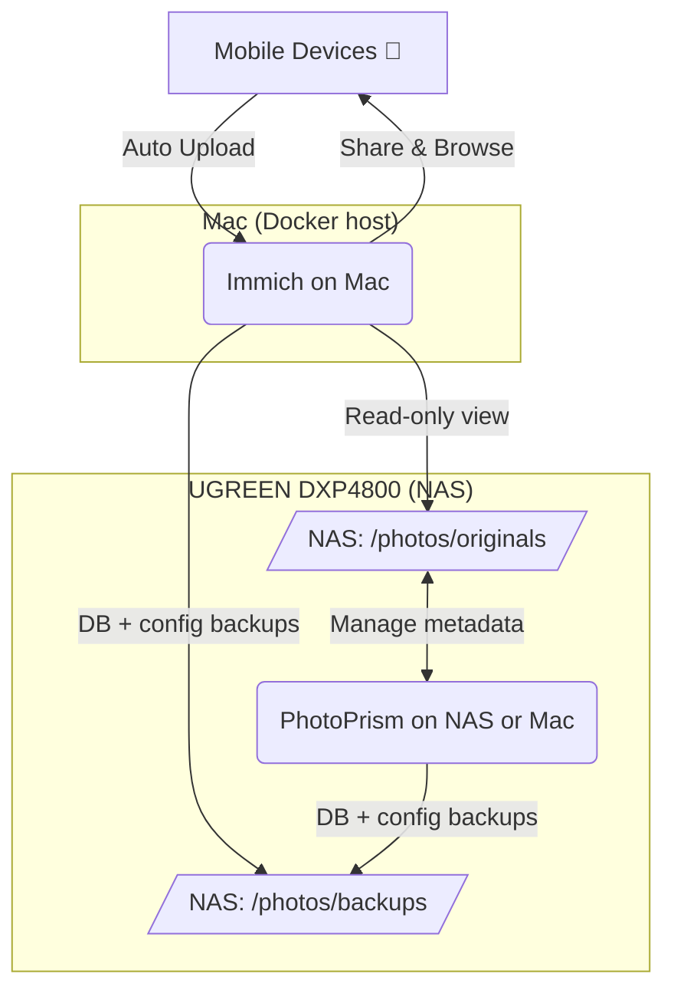

# 📸 Immich + PhotoPrism Hybrid Photo-Stack Setup Playbook

A guide to deploying a self-hosted photo management stack.

## Goal
Run [Immich](https://immich.app) (a Google Photos analog for mobile photo uploads and viewing) and [PhotoPrism](https://photoprism.app) (a Adobe Lightroom analog for metadata management and archival) on a **Mac** with a **Docker-capable NAS**, using:

* Shared NAS storage
* Tailscale for secure remote access
* Weekly automated backups via `launchd`
* Version-controlled configuration

Should work about the same on Linux but hasn't been tested

### 🔄 Daily Usage / Workflow

1. **Auto uploads from phones** → Immich uploads → `/photos/uploads/from-immich/`
2. **Browse & share** → Immich reads `/photos/originals` (read-only)
3. **Curation** → in PhotoPrism, import new uploads into `/photos/originals/YYYY/...`
4. **Archiving** → PhotoPrism updates metadata
   1. Tag, rate, add keywords; PP writes XMP/sidecars.
   2. Work with RAW files
5. Run weekly DB backups → NAS `/photos/backups/`
6. Remote access via Tailscale (private) or Caddy (public)

## 🧬 Architecture Overview


```mermaid
graph TD
  A[Mobile Devices 📱] -->|Auto Upload| B(Immich on Mac)
  B -->|Read-only view| C[/NAS: /photos/originals/]
  C <-->|Manage metadata| D(PhotoPrism on NAS or Mac)
  B -->|Share & Browse| A
  B -->|DB + config backups| E[/NAS: /photos/backups/]
  D -->|DB + config backups| E

  subgraph "Mac (Docker host)"
    B
  end

  subgraph "UGREEN DXP4800 (NAS)"
    C
    D
    E
  end
```

### 🧩 Summary Table

| Task                | Tool       | Host | Notes                    |
| ------------------- | ---------- | ---- | ------------------------ |
| Auto uploads        | Immich     | Mac  | Mobile → NAS             |
| Metadata management | PhotoPrism | NAS  | XMP + tagging            |
| Private access      | Tailscale  | All  | Encrypted mesh VPN       |
| Public sharing      | Caddy      | Mac  | HTTPS + domain           |
| Weekly backup       | launchd    | Mac  | To NAS `/photos/backups` |

## 📂 Repository Structure

```
photo-stack/
├── compose/
│   ├── immich.yml
│   └── photoprism.yml
│   └── caddy.yml
├── scripts/
│   └── setup_nas_mount.sh
│   └── setup_backup_launch_agent.sh
│   └── backup_photo_dbs.sh
│   └── ...
├── Caddyfile.example
├── .env.example
├── .gitignore
└── README.md
```

## 📂 NAS Directory Structure

Subject to change but hopefully helpful overview

```
/photos/
├── originals/                 # Main library (RAW/JPG/Video)
├── uploads/
│   ├── from-immich/           # Mobile auto-upload inbox
├── photoprism/                # PP cache + sidecars
│   ├── storage/
├── immich/                    # Immich DB
│   └── postgres/
└── backups/                   # DB and config backups
    ├── immich/
    └── photoprism/
```


## 🧮 Setup Instructions

### Clone repo

```sh
git clone git@github.com:kareemf/photo-stack-playbook.git
cd photo-stack-playbook
```

### Create .env file

```sh
cp .env.example .env
ln -s .env compose/.env
```

### Setup NAS Directories 

On your storage device

```sh
mkdir -p ~/photos/{originals,uploads/from-immich,photoprism/{storage},immich,backups}
```

...or do it manually

!!! Note
  Potential Gotcha: Keep Immich read-only on /photos/originals to avoid metadata clashes

### Persistent Mount of NAS on Mac

Use the helper script to mount your NAS share with the credentials in `.env` (`NAS_USER`, `NAS_USERPASS`, `NAS_HOST`; optional `NAS_SHARE` defaults to `photos`; `NAS_MOUNT_POINT` defaults to `/Volumes/Photos`):

```bash
chmod +x scripts/setup_nas_mount.sh
./scripts/setup_nas_mount.sh          # add --dry-run to preview without changes
```

The script runs entirely without `sudo`. Make sure `NAS_MOUNT_POINT` already exists and is writable by your macOS user (create it manually if you stick with `/Volumes/Photos`, or set `NAS_MOUNT_POINT` to a directory under your home folder). To prepare the default path once:

```bash
sudo mkdir -p /Volumes/Photos
sudo chown "$USER":staff /Volumes/Photos
```

Re-run the script after reboots to reconnect, or add it to your login items if you want it mounted automatically. Unmount manually with `umount "$NAS_MOUNT_POINT"`.

If you change `NAS_MOUNT_POINT`, remember to update any Docker bind mounts (see the files in `compose/`) so they point to the same path.

Optional: create a user LaunchAgent so the mount script runs at login (and optionally retries):

```bash
chmod +x scripts/setup_mount_launch_agent.sh
./scripts/setup_mount_launch_agent.sh          # add --interval 900 to retry every 15 minutes
launchctl load ~/Library/LaunchAgents/com.user.photo-mount.plist
```

Disable with `launchctl unload ~/Library/LaunchAgents/com.user.photo-mount.plist`. Delete the plist if you no longer need the auto-mount.

### 🐳 Docker Compose
 
*(See the `compose/` directory for full definitions.)*

#### FYI: Makefile Helpers
Keeps the `.env` file wired in and lets you control Immich, PhotoPrism, or Caddy:

```bash
make up # Start both stacks
make immich up
make photoprism up

make pull # Refresh images for both stacks
make immich pull
make photoprism pull

make down # Stop both stacks
make immich down
make photoprism down

make logs follow
make immich logs
make photoprism logs
make logs # Aggregated tail logs for both stacks (tail=100, follow)
```

Internally the Makefile shells out to `docker compose --env-file .env -f compose/<stack>.yml …`. 
Override `ENV_FILE`, `STACK`, or `TAIL` on the command line if needed (e.g. `make STACK=immich TAIL=200 logs`).


💡 Handy commands once everything is up and running
```sh
make immich down && make immich up && make immich logs follow
```

```sh
make photoprism down && make photoprism up && make photoprism logs follow
```

#### Manual Commands
```bash
# Start Immich (Mac mini)
make immich pull
make immich up

# Start PhotoPrism (NAS or Mac)
make photoprism pull
make photoprism up
```

#### Check Container Logs and Health

```sh
docker ps
```

```sh
make logs
```

OR

```sh
docker compose --env-file .env -f compose/immich.yml logs -f --tail=100 immich-server
docker compose --env-file .env -f compose/photoprism.yml logs -f --tail=100 photoprism
```

!!! Note
  You might see `Error: connect ECONNREFUSED 172.18.0.4:5432` from `immich_server` in the logs initally. This is normal while containers are still starting up
 
#### Addresses

PhotoPrism should be available at http://127.0.0.1:2342/
Immich should be available at http://127.0.0.1:2283/

### Immich: Import Read-Only Library
Official docs: https://docs.immich.app/features/libraries/

#### Add library
* Login. 
* Go to http://localhost:2283/admin/library-management
* Add `/originals` when asked for the path, which should line up with the volume mounted in immich.yml (`${NAS_MOUNT_POINT}/originals:/originals:ro`)
* Hit Validate
* Hit Save

#### Exclude RAWs

> We don't want to import the raw files to Immich
 Official docs: https://docs.immich.app/features/libraries/
  
* Menu -> Scan Settings -> Add exlusion pattern
* Add: `**/*.{arw,cr2,cr3,dng,nef,orf,pef,raf,rw2,srw}`
* Hit Save

!!! Note
  If you add additional volumes, expose them to both `immich-server` and `database`

### Staggered First-Run Indexing

```sh
# Run PhotoPrism indexing first
docker compose --env-file .env -f compose/photoprism.yml exec photoprism photoprism index

# Then let Immich scan (it auto-indexes on start;
# if needed, restart after PP completes)
docker compose --env-file .env -f compose/immich.yml restart immich-server
```


## 💾 Backup DB + Configs to NAS

All DB/config backups are stored under `/photos/backups/`.

Script: `scripts/backup_photo_dbs.sh`

Make it executable:

```bash
chmod +x scripts/backup_photo_dbs.sh
```

### ⚙️ Automating Backups (macOS `launchd`)

`launchd` is preferred over `cron` for macOS because it:

* Handles sleep/wake cycles gracefully
* Uses native logging under `~/Library/Logs`
* Can be managed with `launchctl` or `brew services`

#### Dependencies

```bash
brew install watch plistwatch
```

#### Launch Agent: `~/Library/LaunchAgents/com.user.photo-backup-dbs.plist`

Write the Launch Agent plist with the helper script (defaults: Sunday 3 AM; adjust with `--weekday`/`--hour`):

```bash
chmod +x scripts/setup_backup_launch_agent.sh
./scripts/setup_backup_launch_agent.sh
```

Load and verify:

```bash
launchctl load ~/Library/LaunchAgents/com.user.photo-backup-dbs.plist
launchctl start com.user.photo-backup-dbs
launchctl list | grep photo-backup-dbs
tail -f ~/Library/Logs/photo-backup-dbs.log
```

✅ Backups run weekly (Sunday 3 AM). Adjust `Weekday`/`Hour` as needed.

Use `./scripts/setup_backup_launch_agent.sh --help` to see override options.

---

## 🔐 Secure Remote Access + Pretty Names

### 🔐 Tailscale

Use **Tailscale** for private, end-to-end encrypted access to your stack without port forwarding.

📘 **Documentation:**

* [Getting Started with Tailscale](https://tailscale.com/kb/1032/install)
* [MagicDNS](https://tailscale.com/kb/1081/magicdns)

Typical access pattern:

* Immich → `https://mac.tailnet.ts.net:2283`
* PhotoPrism → `https://mac.tailnet.ts.net:2342`

Use [Access Control Lists (ACLs)](https://tailscale.com/kb/1018/acls)[ss Control Lists (ACLs)](https://tailscale.com/kb/1018/acls) to restrict access by user or device.
For secure collaboration, grant Tailnet access to trusted family devices only.

### Pretty Names

Rereqs
- Tailscale has been setup
- `TS_NODE` in .env has been updated

Create `CADDY_CERTS_DIR` and `CADDYFILE_TARGET`

```sh
mkdir -p ~/caddy/{certs} && cp Caddyfile.example ~/caddy/Caddyfile
```

Grab Tailscale Cert. Docs [Caddy certificates on Tailscale
](https://tailscale.com/kb/1190/caddy-certificates#provide-non-root-users-with-access-to-fetch-certificate)

```sh
chmod +x scripts/renew_tailscale_cert.sh
./scripts/renew_tailscale_cert.sh 
```

Optional: link to Caddyfile in the compose/ dir if you want it to be scooped up by the backup script. `compose/Caddyfile` is gitignored

```sh
ln ~/caddy/Caddyfile compose/Caddyfile
```

Bring the proxy online with the Makefile helpers:

```sh
make caddy pull   # optional: fetch latest image
make caddy down && make caddy up && make caddy logs
```

Optional: install launch agent for cert renewal

```sh
chmod +x scripts/setup_renew_tailscale_cert_launch_agent.sh
./scripts/setup_renew_tailscale_cert_launch_agent.sh
launchctl load ~/Library/LaunchAgents/com.user.tailscale-cert.plist
```

### 🌍 Sharing with Non-Tailnet Users

TODO

## 🧰 Quick Recovery

| Task.                   | Command                                                                                                                                                |
| ----------------------- | ------------------------------------------------------------------------------------------------------------------------------------------------------ |
| Rebuild Immich          | `docker compose --env-file .env -f immich.yml up -d --build`                                                                                           |
| Rebuild PhotoPrism      | `docker compose --env-file .env -f photoprism.yml up -d --build`                                                                                       |
| Restart all             | `make down && makup up`                                                                                                                                |
| Stop all                | `make down`                                                                                                                                            |
| Backup DBs              | `docker compose --env-file .env -f immich.yml exec immich-db pg_dumpall -U immich > immich_backup.sql`                                                 |
| Update images & restart | `make pull && make up`                                                                                                                                 |
|                         | `make immich pull && make immich up`                                                                                                                   |
|                         | `make photoprism pull && make photoprism up`                                                                                                           |
| Check launch agents     | tail ~/Library/Logs/photo-mount-error.log ~/Library/Logs/photo-mount.log ~/Library/Logs/photo-backup-dbs-error.log ~/Library/Logs/photo-backup-dbs.log |

## 📚 References

### Official Documentation
- **Immich** – [https://immich.app/docs](https://immich.app/docs)
- **PhotoPrism** – [https://docs.photoprism.app](https://docs.photoprism.app)
- **Docker Compose** – [https://docs.docker.com/compose/](https://docs.docker.com/compose/)
- **Docker Desktop for Mac** – [https://docs.docker.com/desktop/install/mac-install/](https://docs.docker.com/desktop/install/mac-install/)
- **Tailscale** – [https://tailscale.com/kb/](https://tailscale.com/kb/)
  - [Getting Started](https://tailscale.com/kb/1032/install)
  - [MagicDNS](https://tailscale.com/kb/1081/magicdns)
  - [Access Control Lists (ACLs)](https://tailscale.com/kb/1018/acls)
  - [Tailscale Funnel (Public Sharing)](https://tailscale.com/kb/1223/funnel)
- **Caddy Server (Reverse Proxy)** – [https://caddyserver.com/docs/](https://caddyserver.com/docs/)
- **launchd on macOS** – [https://www.launchd.info/](https://www.launchd.info/)

### Community & Support
- [r/selfhosted on Reddit](https://www.reddit.com/r/selfhosted/)
