# 📸 Photo-Stack: Immich + PhotoPrism Hybrid Setup & Runbook
   
## Goal
Run **Immich** (a Google Photos analog for mobile photo uploads and viewing) and **PhotoPrism** (a Adobe Lightroom analog for metadata management and archival) on a **Mac** with a **Docker-capable NAS**, using:

* Shared NAS storage
* Tailscale for secure remote access
* Weekly automated backups via `launchd`
* Version-controlled configuration

Should work about the same on Linux but hasn't been tested

### 🔄 Daily Usage / Workflow

1. **Auto uploads from phones** → Immich uploads → `/photos/uploads/from-immich/`
2. **Browse & share** → Immich reads `/photos/originals` (read-only)
3. **Curation** → in PhotoPrism, import new uploads into `/photos/originals/YYYY/...`
4. **Archiving** → PhotoPrism updates metadata
   1. Tag, rate, add keywords; PP writes XMP/sidecars.
   2. Work with RAW files
5. Run weekly DB backups → NAS `/photos/backups/`
6. **Remote access** via **Tailscale** (private) or **Caddy** (public)

## 🧬 Architecture Overview

```mermaid
graph TD
  A[Mobile Devices 📱] -->|Auto Upload| B(Immich on Mac)
  B -->|Read-only view| C[/NAS: /photos/originals/]
  C <-->|Manage metadata| D(PhotoPrism on NAS or Mac)
  B -->|Share & Browse| A
  B -->|DB + config backups| E[/NAS: /photos/backups/]
  D -->|DB + config backups| E

  subgraph "Mac (Docker host)"
    B
  end

  subgraph "UGREEN DXP4800 (NAS)"
    C
    D
    E
  end
```



### 🧩 Summary Table

| Task           | Tool       | Host     | Notes                    |
| -------------- | ---------- | -------- | ------------------------ |
| Auto uploads   | Immich     | Mac | Mobile → NAS             |
| Metadata management  | PhotoPrism | NAS      | XMP + tagging            |
| Private access | Tailscale  | All      | Encrypted mesh VPN       |
| Public sharing | Caddy      | Mac | HTTPS + domain           |
| Weekly backup  | launchd    | Mac | To NAS `/photos/backups` |

## 📂 Repository Structure

```
photo-stack/
├── compose/
│   ├── immich.yml
│   └── photoprism.yml
├── scripts/
│   └── setup_nas_mount.sh
│   └── setup_backup_launch_agent.sh
│   └── backup_photo_dbs.sh
├── .env
├── .gitignore
└── README.md
```

## 📂 NAS Directory Structure

```
/photos/
├── originals/                 # Main library (RAW/JPG/Video)
├── uploads/from-immich/       # Mobile auto-upload inbox
├── photoprism/                # PP cache + sidecars
│   ├── storage/
│   └── cache/
├── immich/                    # Immich thumbsnails/cache
│   └── thumbs/
└── backups/                   # DB and config backups
    ├── immich/
    └── photoprism/
```


## 🧮 Setup Instructions

### Clone repo

```sh
git clone git@github.com:kareemf/photo-stack.git
cd photo-stack
```

### Setup NAS Directories 

```sh
mkdir -p ~/photos/{originals,uploads/from-immich,photoprism/{storage,cache},immich/thumbs}
```

...or do it manually

!!! Gotcha: Keep Immich read-only on /photos/originals to avoid metadata clashes

### Persistent Mount of NAS on Mac

Use the helper script to configure SMB mounting and autofs from the credentials in `.env` (`NAS_USER`, `NAS_USERPASS`, `NAS_HOST`, optional `NAS_SHARE` will fall back to `photos`):

```bash
chmod +x scripts/setup_nas_mount.sh
./scripts/setup_nas_mount.sh          # add --dry-run to preview without changes
```

The script:

* Creates `/Volumes/Photos` (with `sudo`) and performs an immediate SMB mount.
* Writes `/etc/auto_master.d/photos.autofs` and `/etc/auto_photos` for automatic mounting.
* Runs `automount -cv` so the share reconnects whenever `/Volumes/Photos` is accessed.

Expect to be prompted for your macOS password when `sudo` is required.

### 🐳 Docker Compose
 
*(See the `compose/` directory for full definitions.)*

```bash
# Start Immich (Mac mini)
docker compose --env-file .env -f compose/immich.yml pull
docker compose --env-file .env -f compose/immich.yml up -d

# Start PhotoPrism (NAS or Mac)
docker compose --env-file .env -f compose/photoprism.yml pull
docker compose --env-file .env -f compose/photoprism.yml up -d
```

#### Check Container Logs and Health

```sh
docker ps
docker compose --env-file .env -f compose/immich.yml logs -f --tail=100 immich-server
docker compose --env-file .env -f compose/photoprism.yml logs -f --tail=100 photoprism

```

### Staggered First-Run Indexing

```sh
# Run PhotoPrism indexing first
docker exec -it photoprism photoprism index

# Then let Immich scan (it auto-indexes on start;
# if needed, restart after PP completes)
docker restart immich-server

```

## 💾 Backup DB + Configs to NAS

All DB/config backups are stored under `/photos/backups/`.

Script: `scripts/backup_photo_dbs.sh`

Make it executable:

```bash
chmod +x scripts/backup_photo_dbs.sh
```

### ⚙️ Automating Backups (macOS `launchd`)

`launchd` is preferred over `cron` for macOS because it:

* Handles sleep/wake cycles gracefully
* Uses native logging under `~/Library/Logs`
* Can be managed with `launchctl` or `brew services`

#### Dependencies

```bash
brew install watch plistwatch
```

#### Launch Agent: `~/Library/LaunchAgents/com.user.photo-backup-dbs.plist`

Write the Launch Agent plist with the helper script (defaults: Sunday 3 AM; adjust with `--weekday`/`--hour`):

```bash
chmod +x scripts/setup_backup_launch_agent.sh
./scripts/setup_backup_launch_agent.sh
```

Load and verify:

```bash
launchctl load ~/Library/LaunchAgents/com.user.photo-backup-dbs.plist
launchctl start com.user.photo-backup-dbs
launchctl list | grep photo-backup-dbs
tail -f ~/Library/Logs/photo-backup-dbs.log
```

✅ Backups run weekly (Sunday 3 AM). Adjust `Weekday`/`Hour` as needed.

Use `./scripts/setup_backup_launch_agent.sh --help` to see override options.

---

## 🔐 Secure Remote Access

### 🔐 Tailscale (Recommended)

Use **Tailscale** for private, end-to-end encrypted access to your stack without port forwarding.

📘 **Documentation:**

* [Getting Started with Tailscale](https://tailscale.com/kb/1032/install)
* [MagicDNS](https://tailscale.com/kb/1081/magicdns)

Typical access pattern:

* Immich → `https://mac.tailnet.ts.net:2283`
* PhotoPrism → `https://mac.tailnet.ts.net:2342`

Use [Access Control Lists (ACLs)](https://tailscale.com/kb/1018/acls)[ss Control Lists (ACLs)](https://tailscale.com/kb/1018/acls) to restrict access by user or device.
For secure collaboration, grant Tailnet access to trusted family devices only.

---

### 🌍 Sharing with Non-Tailnet Users

If friends/family don’t use Tailscale, use a **reverse proxy** for public HTTPS access.

#### Option 1: Caddy

```bash
docker run -d --name caddy -p 80:80 -p 443:443 \
  -v ~/caddy/Caddyfile:/etc/caddy/Caddyfile \
  -v caddy_data:/data -v caddy_config:/config caddy:latest
```

``**:**

```
immich.example.com {
  reverse_proxy 127.0.0.1:2283
}
photoprism.example.com {
  reverse_proxy 127.0.0.1:2342
}
```

Caddy auto-generates TLS certificates via Let’s Encrypt.
⚠️ Only open ports 80/443 if you truly need public access.

#### Option 2: Tailscale Funnel (Beta)
For simple external sharing:
👉 [Tailscale Funnel Documentation](https://tailscale.com/kb/1223/funnel)

## 🧰 Quick Recovery

| Task.              |  Comma                                                           |
| ------------------ | ---------------------------------------------------------------- |
| Rebuild Immich     | `docker compose --env-file .env -f immich.yml up -d --build`                     |
| Rebuild PhotoPrism | `docker compose --env-file .env -f photoprism.yml up -d --build`                 |
| Restart all           | `docker restart immich-server photoprism`                           |
| Stop all              | `docker stop immich-server photoprism`                           |
| Backup DBs         | `docker exec immich-db pg_dumpall -U immich > immich_backup.sql` |
| Update images & restart      | `docker compose --env-file .env -f immich.yml pull && docker compose --env-file .env -f immich.yml up -d`                    |
|                    | `docker compose --env-file .env -f photoprism.yml pull && docker compose --env-file .env -f photoprism.yml up -d`                    |

## 📚 References

### Official Documentation
- **Immich** – [https://immich.app/docs](https://immich.app/docs)
- **PhotoPrism** – [https://docs.photoprism.app](https://docs.photoprism.app)
- **Docker Compose** – [https://docs.docker.com/compose/](https://docs.docker.com/compose/)
- **Docker Desktop for Mac** – [https://docs.docker.com/desktop/install/mac-install/](https://docs.docker.com/desktop/install/mac-install/)
- **Tailscale** – [https://tailscale.com/kb/](https://tailscale.com/kb/)
  - [Getting Started](https://tailscale.com/kb/1032/install)
  - [MagicDNS](https://tailscale.com/kb/1081/magicdns)
  - [Access Control Lists (ACLs)](https://tailscale.com/kb/1018/acls)
  - [Tailscale Funnel (Public Sharing)](https://tailscale.com/kb/1223/funnel)
- **Caddy Server (Reverse Proxy)** – [https://caddyserver.com/docs/](https://caddyserver.com/docs/)
- **launchd on macOS** – [https://www.launchd.info/](https://www.launchd.info/)

### Community & Support
- [r/selfhosted on Reddit](https://www.reddit.com/r/selfhosted/)
